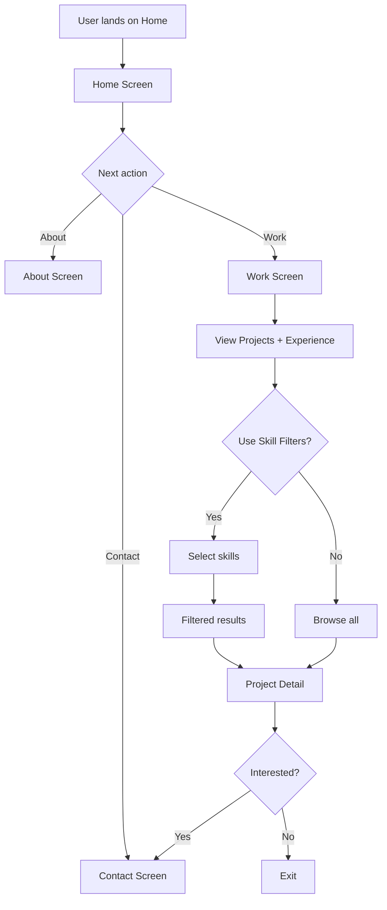
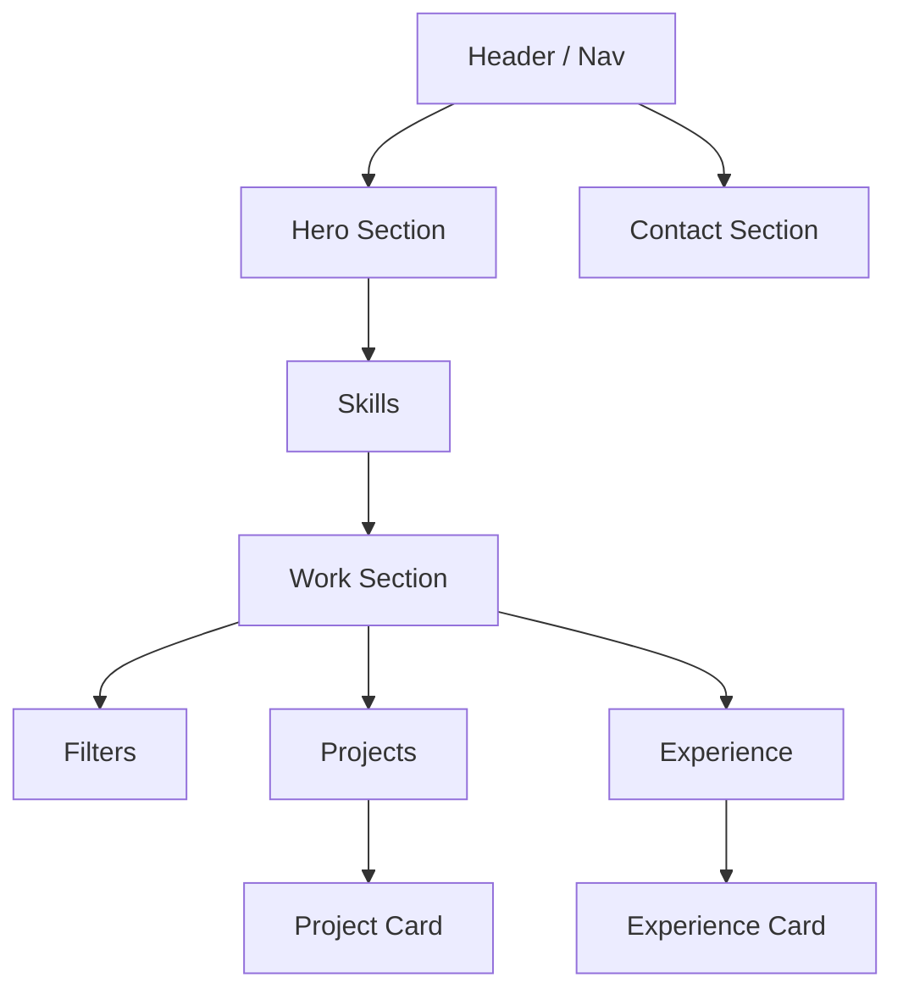
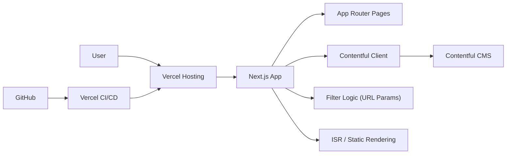

# 🚀 Developer Portfolio (Next.js + Contentful)

A modern, CMS-powered developer portfolio built with **Next.js App Router**, **Contentful**, and deployed on **Vercel**.

This portfolio is designed with a **product mindset**, allowing recruiters and visitors to quickly explore projects and experience by **filtering based on skills**.

---

## 🌐 Live Demo

tbc

---

## ✨ Features

- 🔎 **Skill-based filtering**
  - Filter projects and experience by technologies (React, Next.js, TypeScript, etc.)
  - URL-driven filters (shareable links)

- 🧠 **Unified Work Page**
  - Projects + Experience in one place
  - Faster scanning for recruiters

- 🧾 **Project Detail Pages**
  - Problem → Solution → Tech Stack → Outcome
  - GitHub & live demo links

- 🧩 **Headless CMS (Contentful)**
  - Manage content without code changes
  - Structured data (projects, experience, skills)

- ⚡ **Performance Optimized**
  - Static + ISR rendering
  - Deployed on Vercel Edge

- 🧭 **Clean UX Flow**
  - Home → Work → Filter → Project → Contact

---

## 🧭 User Flow



---

## 🧱 UI Wireframe



---

## 🏗️ System Architecture



---

## 🛠️ Tech Stack

### Frontend

- Next.js (App Router)
- React
- TypeScript
- Tailwind CSS _(or Chakra UI if you choose)_

### Backend / Data

- Contentful (Headless CMS)
- Contentful Delivery API
- Contentful Preview API

### Deployment & DevOps

- Vercel (Hosting + Edge + ISR)
- GitHub (CI/CD integration)

### Features & Architecture

- Server Components
- Client Components (for filters)
- URL Search Params filtering
- Incremental Static Regeneration (ISR)

---

## 🧩 Content Model (Contentful)

### `skill`

- name (React, Next.js, etc.)
- slug (react, nextjs)
- category (frontend, backend, etc.)

### `project`

- title
- slug
- description
- skills (linked entries)
- githubUrl
- liveUrl

### `experience`

- company
- role
- startDate
- endDate
- skills (linked entries)

---

## 🔎 Filtering Logic

- Users select skills → updates URL:

```text
/work?skills=react,nextjs
```

- Filtering applies to:
  - Projects
  - Experience

- Supports:
  - AND filtering (default)
  - OR filtering (optional)

---

## 🚀 Getting Started

### 1. Clone repo

```bash
git clone https://github.com/yourusername/portfolio.git
cd portfolio
```

### 2. Install dependencies

```bash
npm install
```

### 3. Environment variables

Create `.env.local`:

```bash
CONTENTFUL_SPACE_ID=xxx
CONTENTFUL_ACCESS_TOKEN=xxx
CONTENTFUL_PREVIEW_ACCESS_TOKEN=xxx
CONTENTFUL_ENVIRONMENT=master
```

### 4. Run locally

```bash
npm run dev
```

---

## 🚀 Deployment

1. Push to GitHub
2. Import project into Vercel
3. Add environment variables
4. Deploy

---

## 💡 Why this project?

This portfolio demonstrates:

- ✅ Strong frontend engineering (Next.js + TypeScript)
- ✅ CMS-driven architecture
- ✅ Product thinking (filter UX)
- ✅ Scalable data modeling
- ✅ Performance optimization (ISR)

---

## 📬 Contact

- Email: _(your email)_
- LinkedIn: _(your profile)_
- GitHub: _(your GitHub)_

---

## 📄 License

MI
